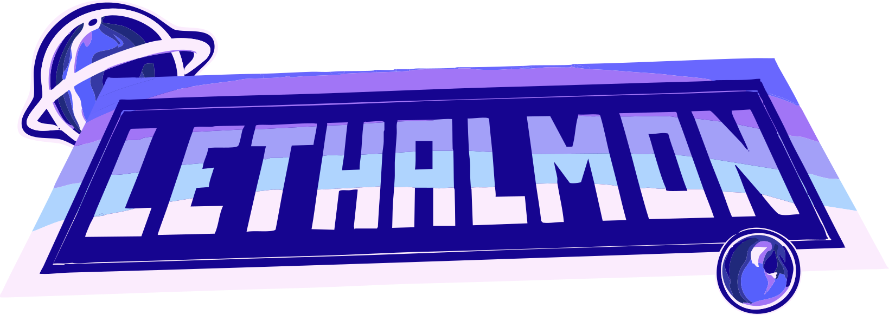

<p align="center">
  
</p>

<h1 align="center">Lethalmon Launcher</h1>

<p align="center">
  Official launcher for <strong>Lethalmon</strong>, a fangame.<br>
  Built with <a href="https://wails.io">Wails v2</a> (Go backend, React/TypeScript frontend).
</p>

## Features

- Download, install, update, and launch the game, with automatic detection
  of an existing install from the old launcher.
- Game settings (resolution, language, volume, auto-save, and more) linked
  directly to the game's own `.gameopts` file.
- Graphics card detection, with an option to force the dedicated GPU on
  dual-GPU setups.
- Self-updating, with cryptographic (ed25519) signature verification of
  update artifacts before install.
- Built-in changelog, live online player count, and a multi-language
  interface (French, English, Italian).

## Development

```
wails dev
```

Runs the app with hot reload on the frontend (Vite dev server) and exposes
the Go backend on `http://localhost:34115` for browser devtools access.

## Building

```
wails build
```

Produces a production build in `build/bin/`.

## License

Distributed under the MIT License. See [LICENSE](LICENSE) for details.
